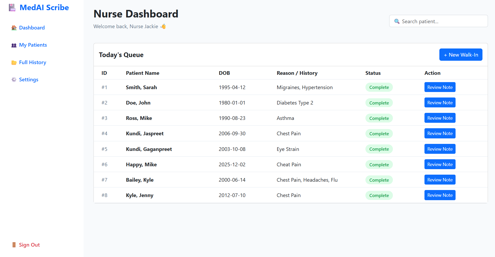
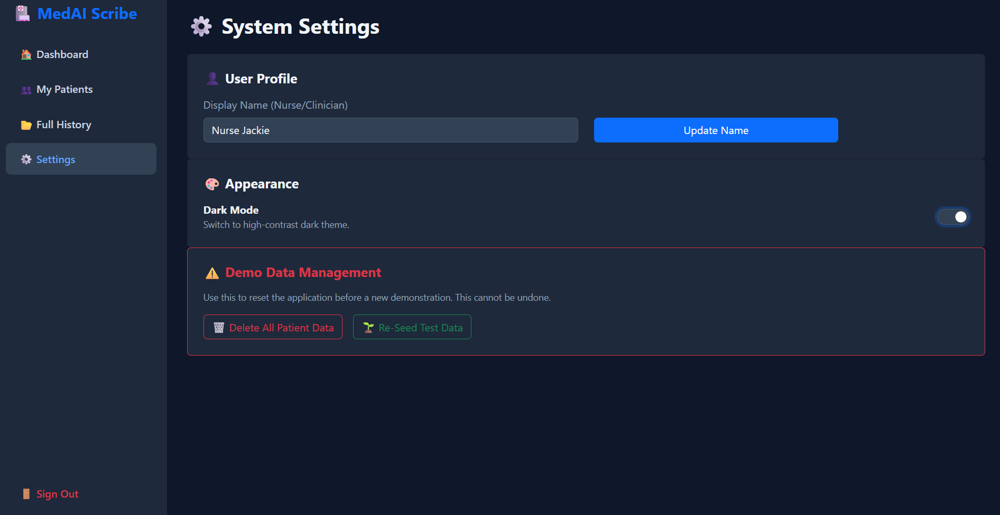
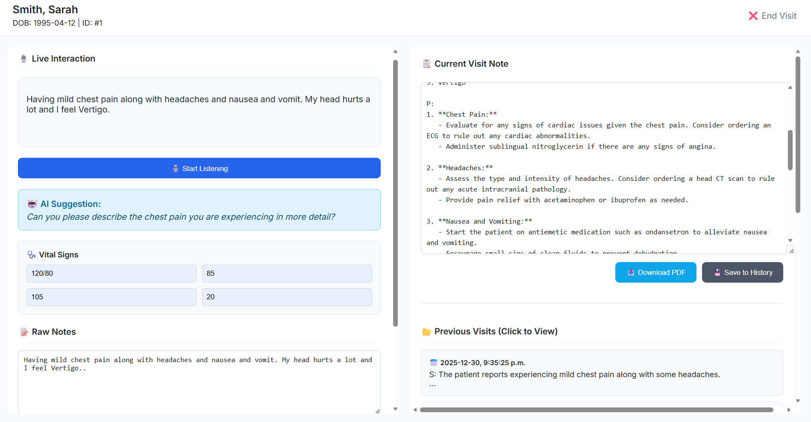
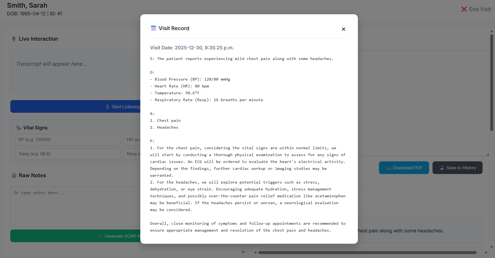

# 🏥 MedAI Scribe: AI-Powered Clinical Documentation Assistant


> **A full-stack medical application designed to reduce nurse burnout by automating the generation of clinical SOAP notes using ambient AI listening.**

---

## 💡 The Problem
Nurses and clinicians spend up to **40% of their shift** on documentation, leading to burnout and less time for patient care. Existing tools are often clunky, hard to use, or lack intelligent analysis of vital signs.

## 🚀 The Solution: MedAI Scribe
MedAI Scribe listens to patient-clinician interactions in real-time, analyzes vital signs for abnormalities, and instantly generates professional, HIPAA-compliant-style **SOAP (Subjective, Objective, Assessment, Plan)** notes.

### ✨ Key Features
* **🎙️ Ambient Scribe:** Real-time Speech-to-Text captures the conversation naturally.
* **🧠 AI Logic Engine:** Uses OpenAI to filter "chitchat" and extract medically relevant facts.
* **🩺 Intelligent Vitals:** Automatically flags abnormal vitals (e.g., High BP, Fever) and ensures the "Plan" section addresses them.
* **🌗 Dark Mode:** A fully responsive UI with a high-contrast dark theme for night-shift clinicians.
* **📄 PDF Export:** One-click generation of official medical records for hospital filing.
* **📂 Patient History:** A persistent SQLite database to track patient visits over time.

---

## 📸 Screenshots

| Nurse Dashboard | Dark Mode Settings |
|:---:|:---:|
|  |  |

| AI SOAP Generation | PDF Export |
|:---:|:---:|
|  |  |

*(Note: These images demonstrate the application's UI and workflow.)*

---

##  Tech Stack

### **Backend (Python)**
* **FastAPI:** High-performance API framework for handling requests.
* **Uvicorn:** ASGI server for production-grade performance.
* **SQLAlchemy:** ORM for managing the SQLite database.
* **OpenAI API:** LLM integration for medical note generation.

### **Frontend (JavaScript)**
* **Web Speech API:** Native browser API for real-time audio transcription.
* **Vanilla JS:** Lightweight, fast frontend logic without heavy framework overhead.
* **Bootstrap 5:** Responsive, clean medical-grade UI components.
* **LocalStorage:** Persists user settings (Dark Mode, Nurse Name).

---

## 🔧 How to Run Locally

### 1. Clone the Repository
```bash
git clone https://github.com/yourusername/medai-scribe.git
cd medai-scribe
```
# Create virtual environment
python -m venv .venv
source .venv/bin/activate  # Windows: .venv\Scripts\activate

# Install dependencies
pip install fastapi uvicorn sqlalchemy openai python-multipart

# Set up your API Key
# (Create a .env file in backend/ or export it in terminal)
export OPENAI_API_KEY="your-key-here"

# Run the Server
uvicorn backend.main:app --reload

### 3. Run Frontend
* Navigate to the `frontend` folder.
* Open `index.html` (Login Page) in your browser.
* *Recommended:* Use "Live Server" extension in VS Code for the best experience.

---

##  Future Improvements
* **Cloud Migration:** Move database to PostgreSQL/AWS RDS.
* **User Auth:** Implement JWT Authentication for secure multi-user login.
* **Voice Commands:** Allow nurses to navigate the UI using voice triggers.

---

###  Disclaimer
*This project is a prototype for educational purposes and demonstrates the application of AI in healthcare workflows. It is not intended for actual medical diagnosis.*